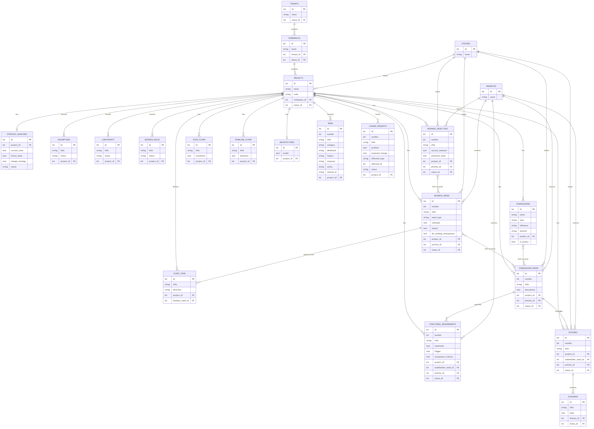
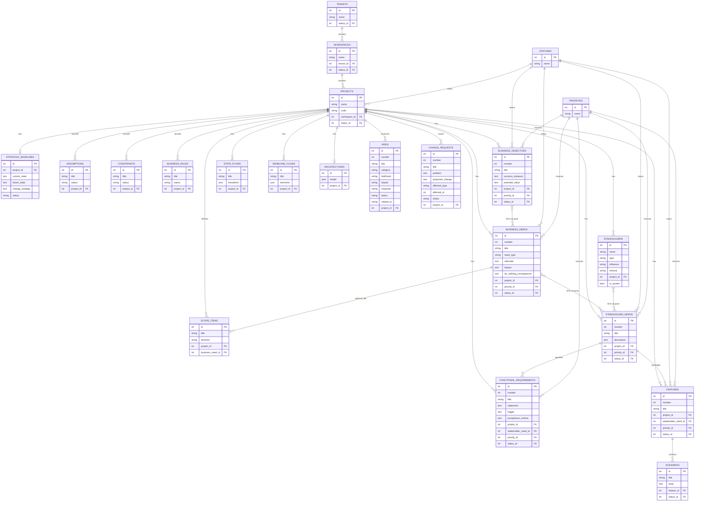

# BAssist Entity-Relationship Diagram

_Generated from live SQLite schema. Render source: [`bassist-erd.mmd`](bassist-erd.mmd)._

**Exportable images (share with mentor):**

- [`bassist-erd.png`](bassist-erd.png)
- [`bassist-erd.svg`](bassist-erd.svg)

Full column-level dictionary: [`bassist-data-dictionary.md`](bassist-data-dictionary.md).

## Need spine ERD

Mermaid source

