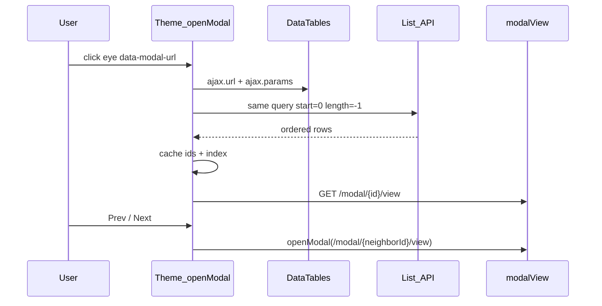

# UI Views — Conventions & Architecture

This document describes how views, themes, pages, modals, and components are organized in this project. Follow these conventions when adding models, customizing screens, or supporting additional themes.

## Design principles

1. **Write business screens once.** Pages describe *what* to show (list, form, details). Themes describe *how* it looks.
2. **Theme-neutral pages.** CRUD pages live under `resources/views/pages/` and must not contain Metronic-specific CSS classes or markup.
3. **Theme-specific components.** Visual differences between Metronic 8 and 9 are handled in `resources/views/themes/{theme}/`.
4. **Convention over configuration.** Drop a blade file in the expected path to override a generic view. Config is only needed for non-standard paths.
5. **Generic CRUD by default.** New routable models get list / form / details / modals automatically. Custom blades are optional.

---

## Architecture layers

```
┌─────────────────────────────────────────────────────────────┐
│  THEME SHELL (master layout, nav, footer, assets, modal host) │
│  themes/{theme}/template.blade.php, partials/, layout/       │
├─────────────────────────────────────────────────────────────┤
│  NEUTRAL PAGES (business content — write once)                │
│  pages/generic/*, pages/modals/*, pages/{resource}/*        │
├─────────────────────────────────────────────────────────────┤
│  THEME COMPONENTS (visual building blocks — per theme)        │
│  themes/{theme}/components/*, controls/form/*                 │
└─────────────────────────────────────────────────────────────┘
```

### Request flow (full page)

```
GET /categories
  → CrudController@index
  → model_page_view('Category', 'list')
  → pages/generic/list.blade.php   (or pages/categories/list if override exists)
  → @extends(ui_layout())          → themes/metronic9/template.blade.php
  → <x-datatable>                    → themes/metronic9/components/datatable.blade.php
```

### Request flow (modal fragment)

```
GET /categories/modal/5/edit  (with X-Modal-Request: 1)
  → CrudController@modalEdit
  → model_modal_view('Category', 'form')
  → pages/modals/form.blade.php          (virtual)
     OR pages/categories/modals/form.blade.php   (hybrid override)
  → <x-modal-content>              → themes/metronic9/components/modal-content.blade.php
  → <x-form :inModal="true">       → virtual: dynamic fields via $formFields
     OR inline Form::field lines   → hybrid: materialized form blade
```

If the same modal URL is opened directly in the browser (no AJAX header), the controller falls back to the **full page** form via `model_page_view()`.

---

## Directory structure

```
resources/views/
├── pages/                              # Theme-neutral app pages
│   ├── generic/                        # Default CRUD pages (all models)
│   │   ├── list.blade.php
│   │   ├── form.blade.php
│   │   └── details.blade.php
│   ├── modals/                         # Default modal fragments (AJAX)
│   │   ├── view.blade.php              # Read-only details in modal
│   │   ├── form.blade.php              # Edit form in modal
│   │   └── delete.blade.php            # Delete confirmation in modal
│   └── {resource}/                     # Optional per-model page overrides
│       ├── list.blade.php              # e.g. pages/categories/list.blade.php
│       ├── form.blade.php
│       ├── details.blade.php
│       └── modals/                     # Optional per-model modal overrides
│           ├── view.blade.php
│           ├── form.blade.php
│           └── delete.blade.php
│
└── themes/
    ├── metronic8/
    │   ├── template.blade.php            # Master layout (HTML shell, assets, modal host)
    │   ├── layout/                     # Header, aside, footer structure
    │   ├── partials/                   # Sidebar, topbar, menu, footer
    │   ├── components/                 # <x-card>, <x-form>, <x-datatable>, etc.
    │   └── controls/form/              # Input markup (text, select, checkbox, …)
    └── metronic9/
        └── (same structure)
```

---

## Naming conventions

| Concept | Format | Example |
|---------|--------|---------|
| Model name (PHP) | StudlyCase | `Category` |
| Resource name (URLs, folders) | plural snake | `categories` |
| Page actions | `list`, `form`, `details` | — |
| Modal actions | `view`, `form`, `delete` | — |
| Route names | `{resource}.{action}` | `categories.index` |
| View dot notation | `pages.{resource}.{action}` | `pages.categories.list` |

Resource name is always:

```php
Str::plural(Str::snake($model)); // Category → categories
```

---

## View resolution

### Full pages — `model_page_view($model, $action)`

Defined in `app/helpers.php`. Used by `BaseController` for `index`, `create`, `edit`, and `show`.

**Resolution order:**

1. **Convention file** — `pages/{resource}/{action}.blade.php` if it exists  
   Example: `pages/categories/list.blade.php`
2. **Config escape hatch** — `config('crud.models.{Model}.views.{action}')` if set and view exists
3. **Generic default** — `pages/generic/{action}.blade.php`

```php
model_page_view('Category', 'list');    // → pages.generic.list (or override)
model_page_view('Category', 'form');    // → pages.generic.form
model_page_view('Category', 'details'); // → pages.generic.details
```

No config entry is required for conventional overrides — create the file and it is picked up automatically.

### Modal fragments — `model_modal_view($model, $action)`

Used by `BaseController` for `modalView`, `modalEdit`, and `modalDelete`.

**Resolution order:**

1. **Convention file** — `pages/{resource}/modals/{action}.blade.php` if it exists  
   Example: `pages/categories/modals/form.blade.php`
2. **Config escape hatch** — `config('crud.models.{Model}.modals.{action}')` if set and view exists
3. **Generic default** — `pages/modals/{action}.blade.php`

```php
model_modal_view('Category', 'view');   // → pages.modals.view
model_modal_view('Category', 'form');   // → pages.modals.form
model_modal_view('Category', 'delete'); // → pages.modals.delete
```

---

## Full page vs modal — why two wrappers?

A modal and a full page are **different delivery formats**, not different business logic.

| | Full page | Modal fragment |
|--|-----------|----------------|
| **View (virtual)** | `pages/generic/form.blade.php` | `pages/modals/form.blade.php` |
| **View (hybrid)** | `pages/{resource}/form.blade.php` | `pages/{resource}/modals/form.blade.php` |
| **Layout** | `@extends(ui_layout())` | None — HTML injected into modal container |
| **Wrapper** | `<x-form-card>` + back button | `<x-modal-content>` |
| **Controller** | `create()`, `edit()` | `modalEdit()` (AJAX) |
| **Field rendering (virtual)** | `<x-form :fieldsArray="$formFields">` | `<x-form :inModal="true">` |
| **Field rendering (hybrid)** | Explicit `Form::field(...)` lines | Explicit `Form::field(...)` lines |

**Virtual** entities build fields at runtime from DTO metadata (`EntityFormBuilder` → `$formFields` → `<x-form>` loop in the theme component).

**Hybrid** entities use **materialized** form blades: the same outer shell, but with one `Form::field(...)` line per `Form` on the edit DTO. Generated by `entity:eject`, `make:entity --profile=hybrid`, or `entity:materialize-form`. See [entity-scaffolding.md](entity-scaffolding.md#materialized-forms).

This is the **only built-in duplication** in the view layer: thin wrappers around the same form layout. Form validation and routes still come from the DTO and repository.

**Note:** Create currently uses only the full page. There is no modal create flow.

Modal fallback behavior (`RespondsWithModal` trait): opening a modal URL directly in the browser renders the equivalent **full page** instead of a fragment.

### Escape and unsaved edit forms

`Escape` closes the shared modal. Script: `pages/partials/modal-close-guard-script.blade.php` (included from theme templates).

If the open modal is an **edit** form (`data-modal-form` with PUT/PATCH) and the field values differ from the baseline captured on `bassist:modal-loaded`, Cancel / backdrop / Escape / X ask for confirmation before discarding changes. Successful save closes with `closeModal({ force: true })` and skips that prompt. Opening another modal URL while an edit is dirty uses the same confirmation.

### Record Prev/Next in view modals

Framework-level navigation between detail **view** modals for the current list context. Enabled by `config('ui.modal_record_nav')` (env: `UI_MODAL_RECORD_NAV`, default `true`).

#### How previous / next are determined

Siblings are **not** `id ± 1` and not raw DB insertion order.

When a view modal opens from a list row, the nearest DataTable already defines the sequence the user is looking at:

1. Repository filters on the ajax URL (workspace/project, relation filters, orphans, …)
2. DataTables global search
3. DataTables column sort

Those are available client-side via `table.ajax.params()` / `table.ajax.url()`.

**Sibling rule:** one request to the **same list API** with the same params, but `start=0` and `length=-1` (all rows), then:

```text
ids = response.data.map(row => row.id)
index = ids.indexOf(currentId)
prev = ids[index - 1]
next = ids[index + 1]
```

That is the full filtered/sorted result set (not only the visible page), aligned with whatever column the user sorted by. `BaseApiController::index` already loads the filtered collection for Yajra; the id materialization reuses that endpoint (no separate neighbors API).



#### Behavior contract

| Case | Nav |
|------|-----|
| View modal opened from a DataTable eye / show action | Prev/Next over full filtered+sorted id list |
| Edit / create / delete modal | No record nav |
| Cross-entity link (`ListUi::relatedEntityCell`, traceability matrix, etc.) | Opt out with `data-modal-nav="off"` |
| Deep link / open without a surrounding DataTable | Controls stay hidden |
| Full-page details route | No record nav |
| DataTable redraw / filter change | Cached fingerprint invalidated; next open from the list refetches ids |

Keyboard: **ArrowLeft** / **ArrowRight** move prev/next while a view modal with nav context is open (ignored in inputs).

#### Extension points (files)

| Piece | Path | Role |
|-------|------|------|
| Theme JS | `pages/partials/modal-record-nav-script.blade.php` (included in metronic9/8 `template.blade.php`) | Capture DT ids, cache state, wire Prev/Next / keys, sync UI on `bassist:modal-loaded` |
| Footer mount | `pages/partials/modal-record-nav.blade.php` | Prev / Next buttons + `n / total` label (`hidden` until JS has siblings) |
| Default view modal | `pages/modals/view.blade.php` | Includes the nav partial in the footer |
| Entity overrides | `pages/{resource}/modals/view.blade.php` | Must `@include('pages.partials.modal-record-nav')` in the footer if they replace it |
| Scaffold stub | `stubs/entity/modal-view.stub` | Same include for new entities |
| Opt-out | `ListUi::relatedEntityCell`, ad-hoc `data-modal-nav="off"` | Do not treat host-table rows as siblings |
| Config | `config/ui.php` → `modal_record_nav` | Feature flag |

On `[data-modal-url]` click, if the URL matches `.../modal/{id}/view` and the trigger is not `data-modal-nav="off"`, theme JS finds the nearest DataTable, builds `{ ids, index, urlForId, returnUrl }`, and reuses `openModal(neighborUrl)` with `preserveRecordNav: true` so history still returns to the list. Closing the modal clears nav state.

#### Hub pages (multi-section lists)

Grouped hubs (e.g. Solution Requirements, Guardrails) should embed standard `<x-datatable defaultButtons>` per section via `pages/partials/hub-entity-section.blade.php` so eye actions open view modals and participate in record nav. Avoid hand-built tables that link to full-page `show` without `data-modal-url`.

#### Non-goals

- No dedicated neighbors/prev-next API (reuse the list DataTables endpoint)
- No record nav on full-page details
- No automatic DataTables page-turn UX beyond the one-time full id list fetch

---

## Theme system

Active theme is set in `.env`:

```
UI_THEME=metronic9
```

Config: `config/ui.php`

### What is theme-specific

| Piece | Location | Purpose |
|-------|----------|---------|
| Master layout | `themes/{theme}/template.blade.php` | HTML shell, CSS/JS assets, `@yield('main')` |
| Navigation | `themes/{theme}/partials/`, `layout/` | Sidebar, header, menu, footer |
| Modal host | `<x-modal>` in template | Empty container; AJAX injects fragments |
| Components | `themes/{theme}/components/` | Card, button, datatable, form, modal-content, … |
| Form controls | `themes/{theme}/controls/form/` | text, select, checkbox, file, … |

### What stays theme-neutral

| Piece | Location |
|-------|----------|
| CRUD pages | `pages/generic/*`, `pages/{resource}/*` |
| Modal content | `pages/modals/*`, `pages/{resource}/modals/*` |

Pages use `@extends(ui_layout())` and `<x-*>` components. Switching `UI_THEME` re-renders the same page with different component markup — no page duplication per theme.

### Helper functions

| Helper | Returns |
|--------|---------|
| `ui_theme()` | Active theme key (`metronic8`, `metronic9`) |
| `ui_layout()` | Theme master layout view name |
| `ui_asset($path)` | URL to theme asset prefix |
| `ui_component_view($name)` | View instance for a theme component |
| `ui_form_view($control)` | Path to a theme form control blade |

### Blade components

PHP classes in `app/View/Components/` use the `ResolvesThemeView` trait to render from `themes/{active}/components/`:

- `<x-card>`, `<x-form-card>`, `<x-form>`, `<x-datatable>`, `<x-details-view>`
- `<x-button>`, `<x-alert>`, `<x-modal>` (page-level modal host)
- `<x-modal-content>`, `<x-modal-dismiss>` (modal fragment chrome)

**Rule for pages:** use components and helpers — never hard-code theme CSS classes in `pages/`.

---

## Adding a new model

Most models require **no new view files**.

1. Create `App\Models\{Model}` with `#[RoutableAttribute]`
2. Create `App\Repositories\{Model}Repository` extending `BaseRepository`
3. Create `App\Data\{Model}Data` with `Form` on properties
4. Optionally register nav/settings in `config/crud.php`

Field metadata is cached in production — see **[docs/dto-metadata.md](dto-metadata.md)** for cache/warm/clear commands.

The generic controller (`CrudController`), generic pages, and generic modals handle the rest.

---

## Customizing a model (optional)

### Override a full page

Create the file — no controller or config change needed:

```
resources/views/pages/products/list.blade.php
```

Override form or details the same way:

```
pages/products/form.blade.php
pages/products/details.blade.php
```

To scaffold owned form markup from DTO metadata (instead of copying generic `<x-form>`):

```bash
php artisan entity:eject Product          # virtual → hybrid (all six blades)
php artisan entity:materialize-form Product   # form blades only
```

Or scaffold hybrid from the start:

```bash
php artisan make:entity Product --profile=hybrid --fields="..."
```

### Override a modal

```
resources/views/pages/products/modals/form.blade.php
```

### Non-standard view path (config)

Use only when the blade does not follow the `{resource}/{action}` convention:

```php
// config/crud.php
'Product' => [
    'views' => [
        'list' => 'pages.shared.hierarchical-list',
    ],
    'modals' => [
        'form' => 'pages.shared.quick-edit-modal',
    ],
],
```

Config is checked **after** the conventional file path. Prefer convention files whenever possible.

---

## What you should not duplicate

| Do not duplicate | Reason |
|------------------|--------|
| Pages per theme | Components absorb visual differences |
| Controllers per model | `CrudController` + `BaseController` are generic |
| Form field markup per model (virtual) | Driven by DTO attributes and `<x-form>` |
| Modals per theme | Neutral modal pages + `<x-modal-content>` |

| Acceptable duplication | Reason |
|------------------------|--------|
| `pages/generic/form` vs `pages/modals/form` | Different delivery format (page vs AJAX fragment) |
| Per-model override blades | Opt-in when generic layout is insufficient |
| Materialized `Form::field` lines (hybrid) | Owned markup; refresh via `entity:materialize-form` |
| Theme components | One set per supported theme (Metronic 8, 9, …) |

---

## Controller reference

`App\Http\Controllers\BaseController` — generic CRUD actions.

| Action | View helper | Default view |
|--------|-------------|--------------|
| `index()` | `model_page_view($model, 'list')` | `pages/generic/list` |
| `create()` | `model_page_view($model, 'form')` | `pages/generic/form` |
| `edit()` | `model_page_view($model, 'form')` | `pages/generic/form` |
| `show()` | `model_page_view($model, 'details')` | `pages/generic/details` |
| `modalView()` | `model_modal_view($model, 'view')` | `pages/modals/view` |
| `modalEdit()` | `model_modal_view($model, 'form')` | `pages/modals/form` |
| `modalDelete()` | `model_modal_view($model, 'delete')` | `pages/modals/delete` |

Model name is resolved automatically in `CrudController` from the route name.

---

## Quick decision guide

```
Need to change how a list looks for one model?
  → Create pages/{resource}/list.blade.php

Need a tree instead of a datatable for categories?
  → Create pages/categories/list.blade.php

Need different modal chrome (header/footer styling)?
  → Edit themes/{theme}/components/modal-content.blade.php

Need a new input type styling?
  → Edit themes/{theme}/controls/form/{type}.blade.php

Need to support Metronic 10?
  → Add themes/metronic10/ (template, components, controls) — pages stay unchanged

Need a shared view used by multiple models?
  → Put blade in pages/shared/ and point to it via config crud.models.*.views.*
```

---

## Container-relative layout (framework)

Portable CSS in **`themes/{theme}/assets/css/ui-layout.css`** (framework-level — not BAssist-specific). Loaded by theme templates before any app override CSS (`bassist.css`).

This is how nested panels (including modals) let children size to the **parent box**, not the browser viewport.

### Default: container queries

| Piece | Attribute / hook | Role |
|-------|------------------|------|
| Host | `data-ui-container` | Declares a sizing context (`container-type: inline-size`) |
| Metronic modal host | `.kt-modal-content` | Named container for dialogs; nested `[data-ui-container]` inside it is neutralized so queries measure this box |
| Child (sm) | `data-ui-span="1"` … `"12"` | Base 12-col span (narrow containers) |
| Child (md) | `data-ui-span-md="…"` | Override when container **≥ 640px** |
| Child (lg) | `data-ui-span-lg="…"` | Override when container **≥ 960px** |

**Behavior (container-relative, not viewport)**

| Stop | Container width | Typical field default | Textarea / dropzone |
|------|-----------------|------------------------|---------------------|
| **sm** | &lt; 640px | 12 | 12 |
| **md** | 640–959px | 6 | 12 |
| **lg** | ≥ 960px | 6 | 12 |

- Thresholds are **px** so theme root `font-size` cannot shift the breaks  
- Vs `modalSizeStyles`: **sm 400 / md 560 / side ~600** stay on sm:12; **lg 720+** → md:6/lg:6 (2-up, half width)

**Layout engines (do not mix `%` width into grid)**

| Parent | How spans size |
|--------|----------------|
| CSS Grid (e.g. Metronic 9 `grid grid-cols-12`) | **`grid-column` only** — never `flex` / `%` `max-width` (those are relative to the *grid area* and crush span-N cells) |
| Bootstrap `.row` (e.g. Metronic 8) | `flex` + `max-width` scoped to `.row > [data-ui-span…]` |

Base and `@container` span rules must share equal specificity (or `@container` higher) so md/lg overrides can win.

**Example (any panel)**

```html
<div data-ui-container>
  <div class="grid grid-cols-12 gap-x-4 gap-y-3">
    <div data-ui-span="12" data-ui-span-md="6" data-ui-span-lg="6">…</div>
    <div data-ui-span="12" data-ui-span-md="6" data-ui-span-lg="6">…</div>
    <div data-ui-span="12" data-ui-span-md="12" data-ui-span-lg="12">…</div>
  </div>
</div>
```

All theme `form` components (Quick Create, modal, and full page create/edit) emit `data-ui-span` / `-md` / `-lg` for every field (type defaults above), and mark their own field wrapper as `data-ui-container` so full-page forms (which have no ancestor modal) still measure the actual card width. Modal content also marks `data-ui-container` (Metronic 9) / modal body (Metronic 8); inside a modal the effective query host is `.kt-modal-content` — the nested container on the form wrapper is neutralized there. Centered dialogs set `width: 100%` + `maxWidth`; side sheets set an explicit ~600px width so the named container measures the panel, not the viewport.

#### Override spans

`#[Form]` / `#[ListForm]` do **not** take span / `quickSpan`. Spans use the type defaults above. Rare overrides set `$field['ui_span']` at form-assembly time (after `EntityFormBuilder` / `getFormFields()`, or in a per-model form override blade). All theme `form` components (Quick Create, modal, full create/edit) honor spans.

```php
// Same at every stop
$fields['title']['ui_span'] = 6;

// Per stop (partial keys merge onto type defaults)
$fields['status_id']['ui_span'] = ['sm' => 12, 'md' => 6, 'lg' => 6];
```

### Force override: `data-ui-size` (explicit only)

Use when you must force density **regardless of container width**. Never auto-synced from modal chrome.

| Value | Effect |
|-------|--------|
| `stack` | Children always full width |
| `spread` | Children always honor the **lg** span (`data-ui-span-lg`, else base `data-ui-span`) even if the host is narrow |

```html
<div data-ui-container data-ui-size="stack">
  …
</div>
```

### Modal window size is separate

`data-modal-size` controls **dialog chrome** only (max-width, side sheet, fullscreen, etc.). It does **not** drive field spans. Resizing the modal changes the container’s width; container queries reflow the fields.

| Size | Meaning |
|------|---------|
| `sm` | Small centered dialog |
| `lg` | Medium centered dialog (`md` alias) |
| `full` | Large centered dialog (~1400px max; `xl` alias) — **default** |
| `fullscreen` | Viewport-filling dialog (`fs` / `modal-fullscreen` aliases) |
| `end` | Right-side sheet (`sheet` alias) |

**Opt in to fullscreen** (Metronic 9):

```blade
{{-- Default open size for this fragment --}}
<x-modal-content :title="$title" size="fullscreen">
```

```html
{{-- Or override on a single open trigger --}}
<button data-modal-url="..." data-modal-size="fullscreen">…</button>
```

Any modal can also switch sizes at runtime via the header size switcher (Small / Medium / Large / Fullscreen / Side). Swimlane and state-flow diagram modals open in `fullscreen` by default.

Metronic 8 maps `fullscreen` to Bootstrap’s `modal-fullscreen` class on the dialog.

App-specific modal quirks (e.g. clear-backdrop side sheets) stay in `bassist.css`.

---

## Related files

| File | Role |
|------|------|
| `app/helpers.php` | `model_page_view()`, `model_modal_view()`, theme helpers |
| `app/Http/Controllers/BaseController.php` | CRUD + modal actions |
| `app/Http/Controllers/CrudController.php` | Route-driven model resolution |
| `app/Http/Controllers/Concerns/RespondsWithModal.php` | AJAX fragment vs full page |
| `config/ui.php` | Active theme, modal flags (`modal_view`, `modal_record_nav`, …) |
| `config/crud.php` | Model overrides, nav, optional view paths |
| `app/Support/CrudEntityRegistry.php` | Auto-discovery of routable models |
| `app/Support/EntityFormBuilder.php` | Runtime form field assembly (virtual entities) |
| `app/Support/EntityFormMaterializer.php` | Generates explicit `Form::field` lines for hybrid form blades |
| `resources/views/pages/partials/modal-record-nav*.blade.php` | View-modal Prev/Next UI + theme JS |
| `resources/views/pages/partials/modal-close-guard-script.blade.php` | Escape + dirty-edit close confirmation |
| `resources/views/pages/partials/hub-entity-section.blade.php` | Hub section card with standard DataTable |
| `public/themes/*/assets/css/ui-layout.css` | Framework container-query layout (`data-ui-*`) |
| `public/themes/metronic9/assets/css/bassist.css` | BAssist-only UI tweaks |

---

## Summary

- **Pages** = business content, theme-neutral, generic by default.
- **Themes** = shell (layout, nav, footer) + components + form controls.
- **Modals** = neutral content pages + theme modal components; not duplicated per theme.
- **Overrides** = optional files under `pages/{resource}/`; config only for edge cases.
- **Expansion** = new models plug into generics; custom blades are the exception, not the rule.
- **Materialized forms** = hybrid entities get owned `Form::field` lines via `entity:eject` or `entity:materialize-form`.
- **Layout** = container queries in `ui-layout.css` (`data-ui-container` / `.kt-modal-content` / `data-ui-span` + `-md` @640 / `-lg` @960); nested `[data-ui-container]` inside `.kt-modal-content` is neutralized; grid uses `grid-column` only, Bootstrap `.row` uses flex/`max-width`; `data-ui-size` is an explicit force only; `data-modal-size` is chrome-only.
